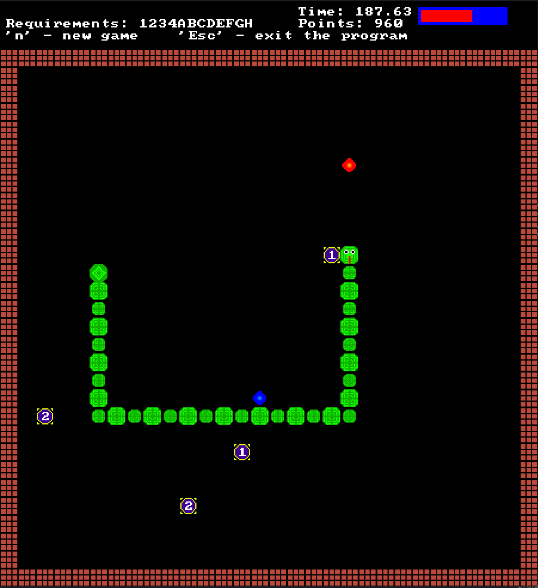

# Snake Game

## Overview

This project is a university assignment focused on implementing the "Snake" video game in C++ using SDL2. A key design choice was to represent the snake as a linked list, allowing for efficient dynamic growth and movement. Due to project constraints, the use of STL functions was limited, requiring custom implementations for various data structures and operations.

Beyond the standard snake gameplay, this project includes several additional features, such as a best score tracking system with player names, game state saving and loading, teleportation mechanics, and AI-controlled gameplay. The game also allows configurable parameters via an external file, making it adaptable to different gameplay experiences.
## Screenshot



## Features

- Graphical interface with a game board and score display.
- Basic snake movement using arrow keys.
- Collision detection with walls and self.
- Ability to restart the game ('n' key) or quit ('Esc' key).
- Display of elapsed time and implemented features.
- Snake length increases when eating food.
- Gradual speed increase over time.
- Bonus red dots with temporary effects (length reduction or speed slowdown).
- Score tracking system.
- Save and load game state.
- Best score tracking with player names.
- Enhanced graphical effects (animated snake body, pulsating food items).
- Teleportation mechanics.
- Configurable game parameters via an external file.

## Controls
- **Arrow Keys**: Move the snake.
- **'Esc'**: Quit the game.
- **'n'**: Start a new game.
- **'s'**: Save the game.
- **'l'**: Load the last saved game.

## Compilation & Execution
### Linux

1. Navigate to the project directory.
2. Create a `build` directory and navigate into it:
   ```bash
   mkdir -p build && cd build
   ```
3. Run CMake to configure the build system:
   ```bash
   cmake ..
   ```
4. Compile the project using:
   ```bash
   make
   ```


